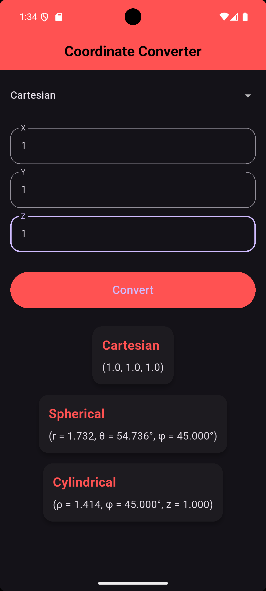
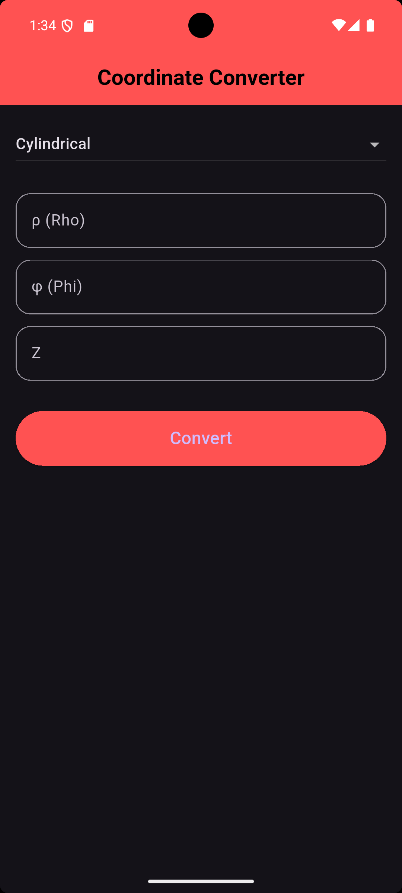
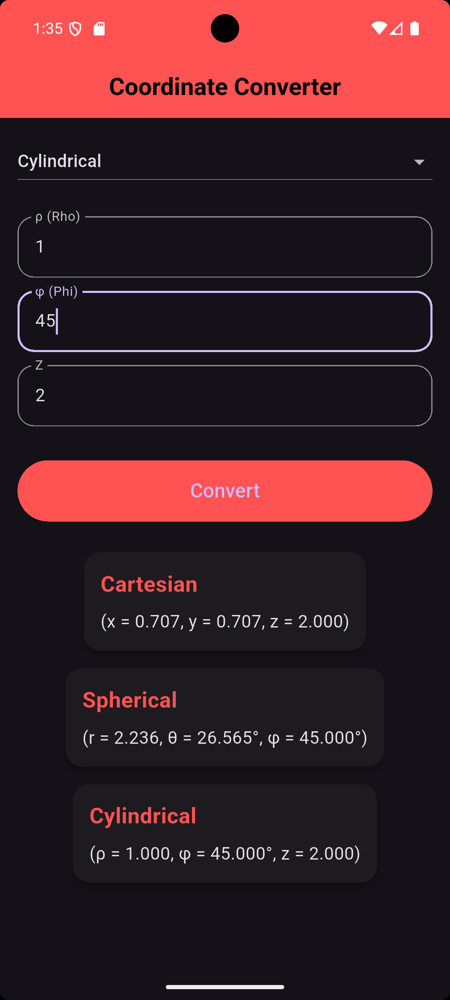
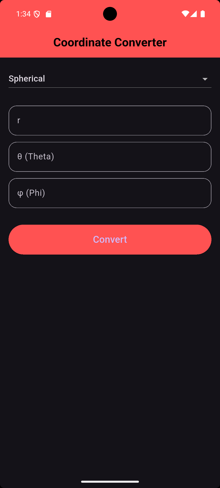
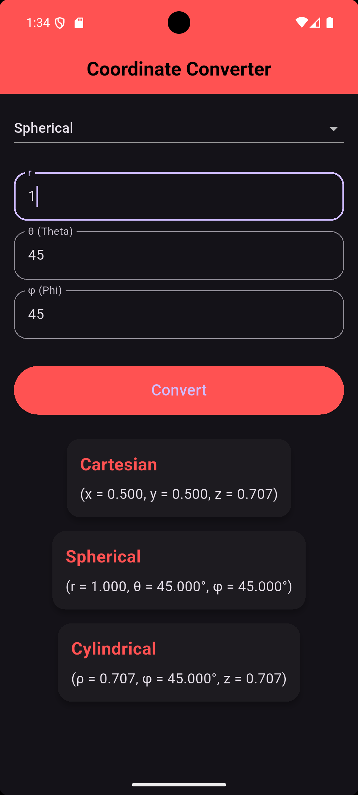

# 📐 Coordinate Converter

<p align="center">
  
</p>

<h1 align="center">
Coordinate Converter
</h1>

<p align="center">
Convert between Cartesian, Cylindrical and Spherical Coordinate Systems using Flutter.
</p>

<p align="center">


</p>

---

# ✨ Overview

Coordinate Converter is a Flutter application that converts points between the three most common 3D coordinate systems.

The application performs all mathematical calculations manually without using external conversion libraries.

Supported systems:

- Cartesian Coordinates
- Cylindrical Coordinates
- Spherical Coordinates

---

# 📸 Screenshots

## 🏠 Home

<p align="center">

</p>

---

## 📍 Cartesian Coordinates

| Cartesian Input | Result |
|-------|--------|
|  |  |

---

## 📍 Cylindrical Coordinates

| Cylindrical Input | Result |
|-------|--------|
|  |  |

---

## 📍 Spherical Coordinates

| Spherical Input | Result |
|-------|--------|
|  |  |

---

# ✨ Features

- Convert Cartesian coordinates.
- Convert Cylindrical coordinates.
- Convert Spherical coordinates.
- Instant conversion to all coordinate systems.
- Manual mathematical calculations.
- Responsive UI.
- Reusable Widgets.
- Clean Architecture.
- Null Safety.

---

# 🧮 Mathematical Formulas

## Cartesian → Spherical

```text
r = √(x² + y² + z²)

θ = arccos(z / r)

φ = atan2(y, x)
```

---

## Cartesian → Cylindrical

```text
ρ = √(x² + y²)

φ = atan2(y, x)

z = z
```

---

## Cylindrical → Cartesian

```text
x = ρ cosφ

y = ρ sinφ

z = z
```

---

## Cylindrical → Spherical

```text
r = √(ρ² + z²)

θ = atan2(ρ, z)

φ = φ
```

---

## Spherical → Cartesian

```text
x = r sinθ cosφ

y = r sinθ sinφ

z = r cosθ
```

---

## Spherical → Cylindrical

```text
ρ = r sinθ

φ = φ

z = r cosθ
```

---

# 📂 Project Structure

```text
lib
│
├── models
│   └── coordinate_result.dart
│
├── utils
│   ├── coordinate_converter.dart
│   └── coordinate_sys_enum.dart
│
├── views
│   └── converter_view.dart
│
├── widgets
│   ├── coordinate_input_field.dart
│   └── result_box.dart
│
└── main.dart
```

---

# 🚀 Getting Started

Clone the repository

```bash
git clone https://github.com/Muhammadkhiry/coordinate_converter.git
```

Move into the project

```bash
cd coordinate_converter
```

Install packages

```bash
flutter pub get
```

Run the application

```bash
flutter run
```

---

# 🛠️ Built With

- Flutter
- Dart
- Material Design

---

# 🔮 Future Improvements

- Dark Mode
- Conversion History
- Copy Result
- Responsive Desktop Layout
- Unit Testing
- Animations

---

# 👨‍💻 Author

**Muhammad Khiry**

Computer and Systems Engineering Student

GitHub

https://github.com/Muhammadkhiry

---

<p align="center">

⭐ If you found this project useful, don't forget to star the repository.

</p>